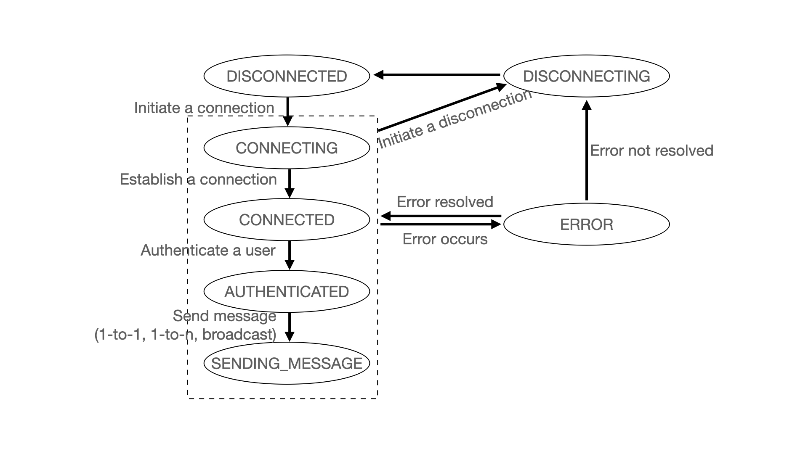

# Chat Protocol Implementation Using QUIC

### Jaz Zhou (jz878@drexel.edu)
### Demo: https://youtu.be/i3k7Nn3DK8Y
This project implements a stateful chat protocol using the QUIC transport layer, building upon the foundational echo server provided by Professor Brian Mitchell. It features both client and server components. The server can handle multiple clients concurrently and includes functionalities such as login authentication, one-to-one messaging, one-to-many messaging, and broadcasting messages

## Project Structure

- `chat_server.py`: Implements the server-side logic of the chat protocol.
- `chat_client.py`: Implements the client-side logic of the chat protocol.
- `quic_engine.py`: Handles the QUIC connection and event dispatching.
- `chat_quic.py`: Defines the connection states and QUIC stream events.
- `pdu.py`: Defines the protocol data units (PDUs) and message serialization.
- `user_db.py`: Manages user authentication and active user sessions.

## Python QUIC Shell


- **Dependencies**: Install dependencies with pip. A `requirements.txt` file is provided.
- **Certificates**: The certificates in the `./certs` directory are fine for testing. 
- **Running the Server**: Run `python3 chat_server.py` to start the server with defaults. I change the server port to be 4433 as required to bind to a hardcoded port number
- **Running the Client**: Run `python3 chat_client.py` to start the client with defaults.

Correct output for server:

```sh
(.venv) ➜  python git:(main) ✗ python3 chat.py server
[svr] Server starting...
```

Correct output for client:


```sh
(.venv) ➜  python git:(main) ✗ python3 chat.py client
Enter username:
```


## Terminal Command-Line Interface Usage

This section outlines the steps and command formats for interacting with the chat application via the terminal.

### Starting the Chat Client
Open your terminal and execute the chat client application. You will be immediately prompted to log in.

```bash
python chat_client.py
```

### Authenticating
You will need to enter your username and password as prompted:

```plaintext
Enter username: alice
Enter password: p1
```

#### User Database Example
For illustration purposes, the `user_db.py` contains only three users defined as follows:

``` python
self.users = {
    "alice": bcrypt.hashpw("p1".encode(), bcrypt.gensalt()),
    "bob": bcrypt.hashpw("p2".encode(), bcrypt.gensalt()),
    "cam": bcrypt.hashpw("p3".encode(), bcrypt.gensalt())
}
```

### Sending Messages
Once you are authenticated, you can send messages using the following formats:

#### Broadcast Message
To send a message to all active users:

```sh
0: Your message here
```

Example:

```sh
0: Good morning everyone!
```

#### One-to-One Messaging
To send a message to a specific user:

```sh
user_id: Your message here
```

Example:

```sh
1: Hi Alice, how are you today?
```

#### One-to-Many Messaging
To send a message to multiple specific users:

```sh
user_id1,user_id2: Your message here
```

Example:

```sh
1,3: Meeting at 3 PM, don't forget!
```

### Logging Out
To properly log out from the chat application, type `logout` and press enter, or simply close your terminal session.

```plaintext
logout
```

### Example Session
Here is what an example session might look like from login to logout:

```sh
# User logs in
Enter username: alice
Enter password: p1

# User sends a one-to-one message
1: Hi Alice, how are you today?

# User sends a one-to-many message
1,3: Meeting at 3 PM, don't forget!

# User broadcasts a message
0: Good morning everyone!

# User logs out
logout
```

## Features

### Stateful Protocol Implementation (Details see section 'State Management Using DFA`)
The chat protocol maintains state information across the communication session, allowing effective management of different states of interaction between the client and server.

### QUIC Transport Layer
Utilizes QUIC for reliable and secure communication, offering improved performance due to reduced latency, multiplexing without head of line blocking, and enhanced congestion control.

### Asynchronous Server and Client
Both the server and client can handle multiple simultaneous connections using asyncio, enhancing scalability and efficiency.

### Version for Future Extension
The protocol includes a version negotiation phase to ensure compatibility across different versions, using `MSG_TYPE_VERSIONS` for this negotiation. This feature allows the protocol to adapt to future extensions by selecting the highest compatible version that both client and server support.

- **Version Negotiation**: When a client connects, it sends a message listing the versions it supports. The server then responds with the highest compatible version.
- **Version Handling**: The protocol can adapt features or message formats based on the negotiated version, ensuring backward compatibility and seamless integration of new features.
- **Versioning in PDUs**: Every `Datagram` in the protocol includes a version field, ensuring messages are interpreted correctly according to the agreed protocol version.

### Secure User Authentication
Authentication uses bcrypt to hash passwords, ensuring security and integrity of user data. Upon receiving a `MSG_TYPE_LOGIN`, the server authenticates the credentials and transitions to `AUTHENTICATED` if successful. Users are given three attempts to login, with each attempt timed at 60 seconds.

### Messaging Capabilities
- **One-to-One Messaging**: Authenticated users can send messages directly to a specific user. Messages can only be sent to active users. If the target user is not active, the sender receives an error message indicating that the user is inactive.
  
- **One-to-Many Messaging**: Supports sending messages to multiple users simultaneously. This feature attempts to deliver the message to all specified recipients. If any of the specified users are not active, the active users will still receive the message, but the sender will be notified of the inactive or invalid users via an error message.

- **Broadcast Messaging**: Enables messages to be sent to all connected and authenticated users. All active users receive the message, enhancing the communication efficiency across the user base.

Each messaging type is handled based on the user's authentication state and the specific message type received by the server.

## Keep-Alive Mechanism
To maintain the connection, clients periodically send `MSG_TYPE_ALIVE` messages. This helps in keeping the connection active, especially during periods of inactivity.


## State Management Using DFA
The chat protocol operates as a deterministic finite automaton (DFA), where each state represents a specific condition of the connection:

## States

- **DISCONNECTED**: No active connection.
- **CONNECTING**: Connection initiation in progress.
- **CONNECTED**: Connection established but not yet authenticated.
- **AUTHENTICATED**: User has been authenticated.
- **SENDING_MESSAGE**: In the process of sending messages.
- **DISCONNECTING**: Connection is closing.
- **ERROR**: An error state that can lead to disconnection or an attempt to recover.

## Transitions
Transitions between these states are triggered by events such as successful connection, authentication, message sending, or errors. This DFA approach ensures robust state management and helps prevent issues that can arise from unexpected state changes.

- **DISCONNECTED to CONNECTING**: Initiate connection.
- **CONNECTING to CONNECTED**: Connection established.
- **CONNECTED to AUTHENTICATED**: User logs in and is authenticated.
- **Any to ERROR**: On errors.
- **ERROR to Previous**: When error addressed
- **ERROR to DISCONNECTING**: When error not addressed
- **AUTHENTICATED to SENDING_MESSAGE**: After sending a message, and will stay as is unless error happens or 'logout' input triggers disconnecting
- **Any to DISCONNECTING**: Initiate disconnection.
- **DISCONNECTING to DISCONNECTED**: Disconnection complete.



## Extra Credit
- **Asynchronous Implementation**: The server can handle multiple clients concurrently, demonstrating the use of asyncio for asynchronous operations.
- **Using Github as Deliverable Method**
- **Implementation Robustness**: As suggested in the feedback from Project Part 3a, I needed to implement just two features: login and one-to-one messaging, for this individual project. However, I managed to also incorporate additional functionalities for one-to-many messaging and broadcasting.
- **Demo Skills**: Provided a video demo with a voice-over demonstrating my running protocol and describing its key features
